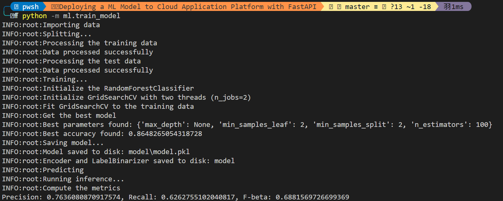
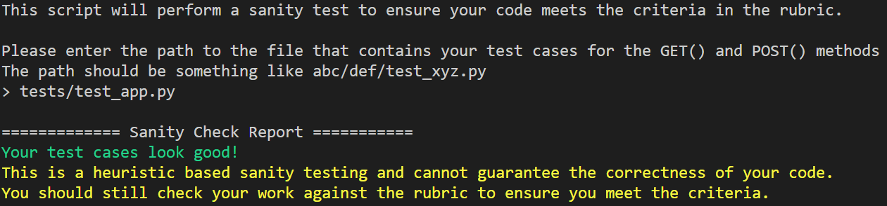
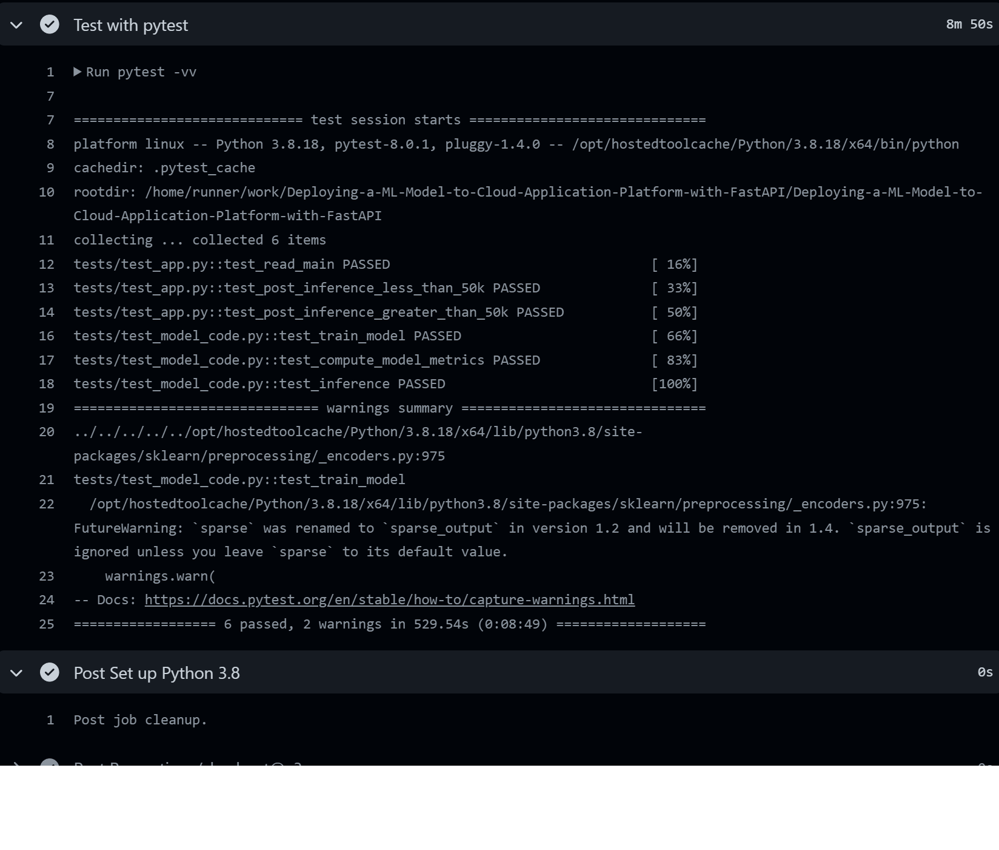
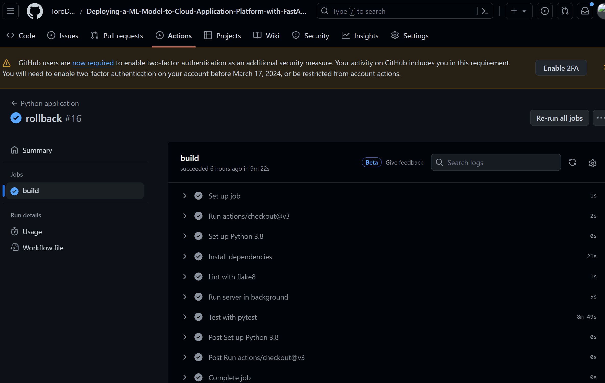
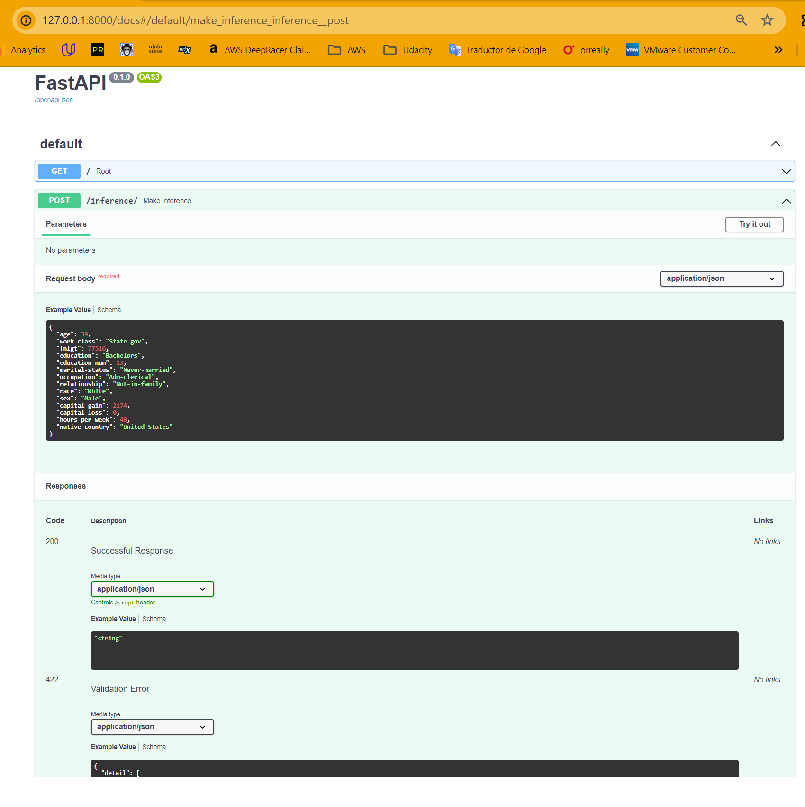
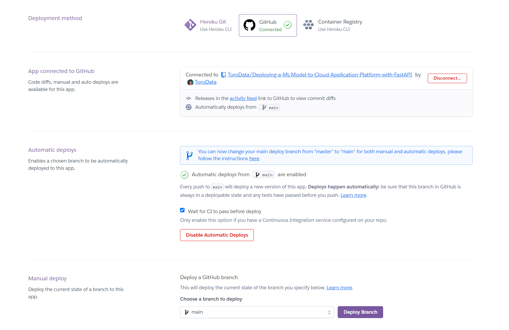

# Deployment of a Machine Learning Model with FastAPI and Heroku

https://github.com/ToroData/Deploying-a-ML-Model-to-Cloud-Application-Platform-with-FastAPI

This repository contains the third project of Udacity's ML DevOps Engineer Nanodegree. The project's objective is to deploy a machine learning (ML) model using FastAPI on Heroku, enabling an inference endpoint accessible via the web. The project encompasses the end-to-end process from training the ML model to deploying it for real-world use.

## Project Overview

- **Model Training**: The project begins with training an ML model on a classification task. The goal is to predict whether an individual's salary exceeds $50,000 based on 14 characteristics. For detailed information about the model and dataset used, refer to the [model card](link-to-model-card).

- **API Creation**: We expose the trained model through a FastAPI application, creating an accessible inference endpoint.

- **Deployment**: The FastAPI app is deployed on Heroku, allowing for web-based interactions with the model.

- **CI/CD Workflow**: Integration of Continuous Integration (CI) and Continuous Deployment (CD) workflows using GitHub Actions ensures that changes are automatically deployed to Heroku after passing automated tests.

## Using the API

Once deployed, the FastAPI app can be accessed via the Heroku app URL. A welcome message is displayed as an indication of a successful deployment. For performing inferences, use the `post_to_API.py` script which sends a sample item to the `/inference` endpoint, and the prediction is returned along with the submitted sample item details.

## Key Files and Directories

- `Procfile`: Specifies the commands that are executed by the app on startup on Heroku.
- `requirements.txt`: Lists all Python libraries required for the project, also used by Heroku for setting up the environment.
- `main.py`: The FastAPI application script.
- `model/`: Directory containing the trained ML model and other necessary artifacts for inference.

## Environment and Setup

The project is developed on Windows WSL2 using Python 3.8 within a virtual environment. The `requirements.txt` file includes all the necessary packages for running the application and replicating the development environment on Heroku.

## Getting Started

### Local Setup

1. Clone the repository.
2. Create a virtual environment and activate it.
3. Install the dependencies using `pip install -r requirements.txt`.
4. Run `uvicorn main:app --reload` to start the FastAPI application locally.


## Commands
Run to clean the data:

```
python -m preprocess.clean
```

If you want to train a model locally, run this:

```
python -m ml.train_model
```


### Deploying to Heroku

1. Create a Heroku account and a new app.
2. Connect your GitHub repository to Heroku and enable automatic deployments.
3. Ensure that CI/CD checks pass for deployments to proceed.



### Testing the API

Unit tests for the API are located in `tests/test_app.py`. Run these tests using `pytest` to ensure the application behaves as expected.



## Continuous Integration and Deployment

GitHub Actions is configured to automate testing and linting, ensuring code quality and functionality before deployment to Heroku. Automatic deployments are triggered upon successful completion of these checks.








## Project Achievements

- Successfully trained a classification ML model to predict salary categories.
- Deployed a FastAPI app on Heroku, making the ML model accessible via a web endpoint.
- Integrated CI/CD workflows for automated testing and deployment.
